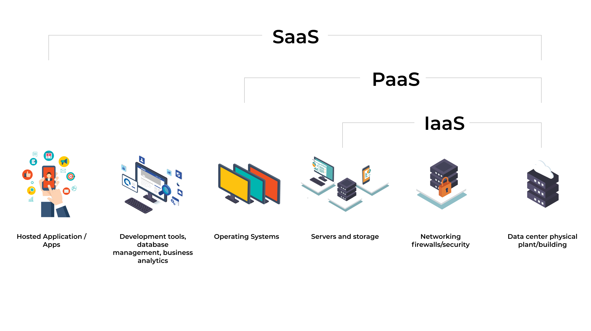

## Tipos de serviço de nuvem na Azure

### Tipos:
- **IaaS** (Infraestrutura como serviço)
- **PaaS** (Plataforma como serviço)
- **SaaS** (Software como serviço)

---

## Modelo de responsabilidade compartilhada:

- **IaaS** → Mais flexível, configuração de hardware é responsabilidade do usuário.

- **PaaS** → Focado no desenvolvimento de apps, gerenciamento da plataforma é responsabilidade do provedor.

- **SaaS** → Pagamento conforme o uso, usuário paga pelo software que utiliza modelo de assinatura.

.jpeg)

